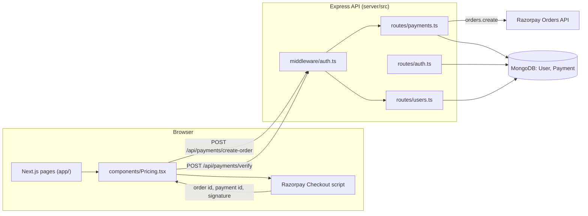

# NoseBoop

A Next.js marketing site for a fictional dog-matching app, paired with a small Express + MongoDB API that handles email/password auth and a Razorpay order-and-verify subscription flow.

## Overview

NoseBoop started as a static Bootstrap landing page and was ported to the Next.js App Router. The frontend is almost entirely content: 16 routes of marketing, legal and support pages plus a pricing section.

The backend in `server/` is a separate npm package: an Express app with three routers (auth, users, payments), two Mongoose models, and one JWT middleware. It is the part of the repo with actual request handling, persistence and a third-party integration.

The one non-trivial flow is the subscription purchase: the browser asks the API to create a Razorpay order, opens Razorpay Checkout, then posts the resulting signature back to the API, which recomputes the HMAC and activates a one-month subscription on the user document.

The two halves are joined by a small login and registration form in `components/LoginModal.tsx`, which stores the JWT that the payment endpoints require. The flow has been type-checked and built, but not exercised against live Razorpay keys in this repository. See [Status and Limitations](#status-and-limitations).

## Architecture



Payment flow as implemented in `server/src/routes/payments.ts` and `components/Pricing.tsx`:

1. `Pricing.tsx` reads the JWT from `localStorage` and posts `{ planId }` to `/api/payments/create-order`. The server looks up the price for that plan; the client does not supply an amount.
2. The API creates a Razorpay order (currency `INR`) and inserts a `Payment` document with status `pending`.
3. The browser loads `checkout.razorpay.com/v1/checkout.js` and opens Checkout with the returned order id.
4. On success the browser posts `razorpay_order_id`, `razorpay_payment_id` and `razorpay_signature` to `/api/payments/verify`. The plan is read from the stored `Payment`, and a repeat call for a completed payment returns the existing subscription without extending it.
5. The API computes `HMAC-SHA256(order_id + "|" + payment_id)` with `RAZORPAY_KEY_SECRET`, compares it to the signature, looks up the `Payment` by order id and user id, marks it `completed`, and writes a one-month `subscription` onto the `User`.

## Tech Stack

| Layer | Used in code |
| --- | --- |
| Frontend | Next.js 16 (App Router), React 18, TypeScript, Bootstrap 5 (CSS import plus CDN JS bundle), Axios |
| Backend | Express 4, TypeScript, Mongoose 8, jsonwebtoken, bcryptjs, razorpay SDK, cors, dotenv |
| Dev tooling | ts-node-dev (API dev server), tsc (API build) |
| Deploy config | `vercel.json` (frontend), `server/render.yaml` (API) |

The root `package.json` also lists `jsonwebtoken`, `bcryptjs` and `razorpay`, but nothing in the frontend imports them.

## Key Engineering Decisions

- **Stateless JWT auth with a per-request user lookup.** `routes/auth.ts` signs `{ userId }` with a 7-day expiry. `middleware/auth.ts` verifies the bearer token, then loads the user from MongoDB (excluding the password field) and attaches it to the request, so a deleted user is rejected even with a valid token. There are no refresh tokens and no revocation.
- **Password hashing in the model, not the route.** `models/User.ts` hashes in a `pre('save')` hook (bcrypt, 10 salt rounds), guarded by `isModified('password')`, and exposes `comparePassword` as an instance method. Login returns the same `Invalid credentials` message for unknown email and wrong password.
- **Pending record before checkout.** `create-order` persists a `Payment` with status `pending` before the client opens Checkout, and `verify` looks it up by both `razorpayOrderId` and the authenticated `userId`, so one user cannot complete another user's order.
- **Client-callback verification instead of webhooks.** Subscription activation depends on the browser calling `/verify` after Checkout. There is no Razorpay webhook handler, so a payment captured while the tab is closed stays `pending`.
- **Subscription embedded in the user document.** `subscription` is a subdocument on `User` (`planId`, `planName`, `startDate`, `endDate`, `isActive`) rather than a separate collection. Nothing reads `endDate` or flips `isActive` back to false.
- **Frontend and API deployed separately.** The browser calls the API directly using `NEXT_PUBLIC_API_URL`; the API enables `cors()` with default settings (all origins).

## Data Model / API

| Model | Fields |
| --- | --- |
| `User` | `email` (unique, lowercased), `password` (bcrypt hash, min length 6), `name`, `subscription { planId, planName, startDate, endDate, isActive }`, timestamps |
| `Payment` | `userId` (ref `User`), `orderId` (unique), `amount`, `currency`, `planId` (`plus`, `gold`, `premium`), `planName`, `status` (`pending`, `completed`, `failed`), `razorpayOrderId`, `razorpayPaymentId`, `razorpaySignature`, timestamps |

| Method | Path | Auth | Behaviour |
| --- | --- | --- | --- |
| POST | `/api/auth/register` | none | Creates a user, returns `{ token, user }` (201) |
| POST | `/api/auth/login` | none | Checks password, returns `{ token, user }` |
| POST | `/api/auth/google` | none | Stub. Always returns 501 |
| GET | `/api/users/me` | Bearer JWT | Returns the current user without the password |
| POST | `/api/payments/create-order` | Bearer JWT | Creates a Razorpay order and a `pending` Payment |
| POST | `/api/payments/verify` | Bearer JWT | Verifies the signature, completes the Payment, activates the subscription |
| GET | `/health` | none | Static `{ status: "OK" }` response; does not check MongoDB |

Error handling is a `try/catch` in each handler that returns `{ message }` with 400, 401, 404 or 500. There is no shared error middleware, no request validation library and no structured logging; the payment routes log failures with `console.error`.

## Project Structure

```
app/                  Next.js App Router pages (16 routes) and root layout
components/           Navbar, Footer, LoginModal, Pricing, Features, Testimonial
css/                  Stylesheets imported by app/layout.tsx
lib/                  Axios instance and auth helpers, used by LoginModal
public/               Icon and images served by Next.js
server/
  src/index.ts        Express bootstrap, MongoDB connection, route mounting
  src/routes/         auth.ts, users.ts, payments.ts
  src/models/         User.ts, Payment.ts
  src/middleware/     auth.ts (JWT guard)
  render.yaml         Render service definition
vercel.json           Vercel build settings and an /api rewrite
QUICKSTART.md         Older setup notes

Leftovers from the original static site (not used by the Next.js app):
index.html, safety.html, support.html, js/navbar.js,
components/navbar.html, components/login-modal.html,
images/ (duplicate of public/images), NoseBoop/ (earlier "TinDog" copy)
```

## Running Locally

Requires Node.js, a MongoDB instance and Razorpay test keys. There is no `.env.example` in the repo; the variables below are the ones the code reads.

```bash
# install
npm install
cd server && npm install && cd ..

# terminal 1: API on http://localhost:5000
npm run server

# terminal 2: frontend on http://localhost:3000
npm run dev
```

`server/.env`:

```
MONGODB_URI=mongodb://localhost:27017/tindog
JWT_SECRET=<random string>
RAZORPAY_KEY_ID=<razorpay test key id>
RAZORPAY_KEY_SECRET=<razorpay test key secret>
PORT=5000
```

`.env.local` at the repo root:

```
NEXT_PUBLIC_API_URL=http://localhost:5000
NEXT_PUBLIC_RAZORPAY_KEY_ID=<razorpay test key id>
```

Production builds: `npm run build && npm start` for the frontend, and `npm run build && npm start` inside `server/` for the API (`tsc` to `dist/`, then `node dist/index.js`).

## Testing

No automated tests yet. Neither package has a test script or test dependencies, and there is no CI configuration. The root `lint` script exists but the repo has no ESLint config or dependency.

## Status and Limitations

- **Auth UI is minimal.** `LoginModal.tsx` has an email/password form for login and registration through `lib/auth.ts`. There is no logged-in indicator, logout control, password reset or Google sign-in (the `/api/auth/google` route is a 501 stub).
- **Plan prices are defined twice.** The server's `planDetails` table (0 / 899 / 1499 INR) decides what is charged; `components/Pricing.tsx` repeats the same numbers for display.
- **Fallback JWT secret.** If `JWT_SECRET` is unset, the code signs and verifies with the literal `'your-secret-key'`.
- **MongoDB connection failures are logged, not fatal.** The server keeps listening and `/health` still returns OK.
- **No rate limiting, input validation, security headers, webhooks, refunds, or subscription expiry job.** The `failed` payment status is never written.
- **`vercel.json` rewrites `/api/*` to a placeholder host** (`your-render-backend-url.onrender.com`). The frontend does not rely on it because it calls `NEXT_PUBLIC_API_URL` directly.
- **Content is placeholder.** Testimonials, press logos, stories, blog entries and contact addresses are illustrative; the home page "Download on App Store" button has no handler and the links inside the login modal point to `#`.
- **Naming is mixed.** Package names, the default database name and contact addresses still use the earlier project name "TinDog".
